# BACS2063 Data Structures and Algorithms

## Table of Contents

[1. Main Menu](#part-1--main-menu)

[2. Programme Management Subsystem (Wong Fu Lim)](#part-2--programme-management-subsystem-wong-fu-lim)

[3. Tutorial Group Management Subsystem (Dong Wei Jie)](#part-3--tutorial-group-management-subsystem-dong-wei-jie)

[4. Tutor Group Management Subsystem (Desmond Tan Zhe Xuan)](#part-4--tutor-group-management-subsystem-desmond-tan-zhe-xuan)

## Part 1 : Main Menu

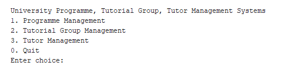

Figure 1 Main Menu

## Part 2 : Programme Management Subsystem (Wong Fu Lim)

| Description | Image |
|-------------|-------|
| Programme Management Subsystem Menu | 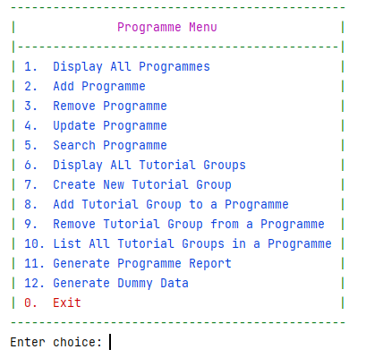 |
| Display All programmes when the programme is empty (All other choices will also get the error message when programme or tutorials groups are empty) | 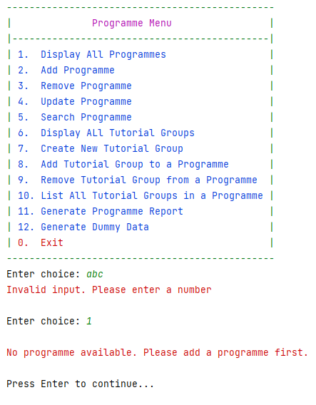 |
| Generate Dummy Data | 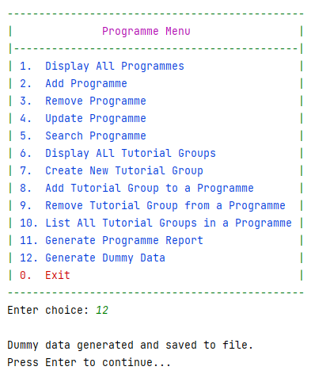 |
| Display all programmes |  |
| Add a new programme | 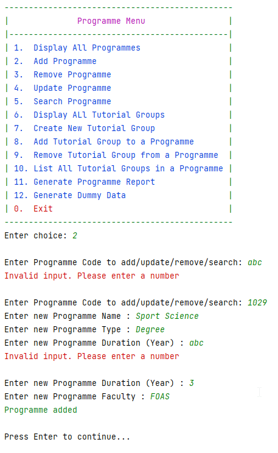 |
| Remove a programme |  |
| Update a programme |  |
| Search a programme that with wrong code | 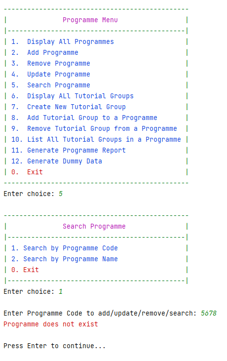 |
| Search a programme with correct code |  |
| Search a programme by name |  |
| Display all tutorial groups | 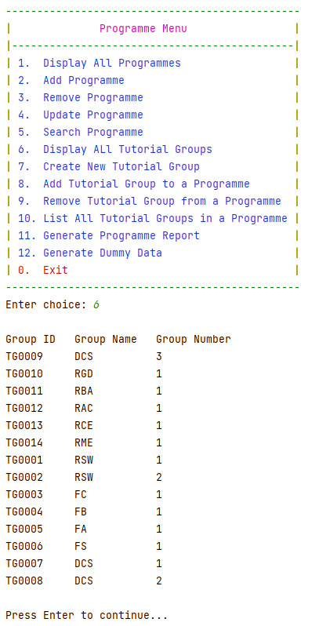 |
| Create new tutorial group | 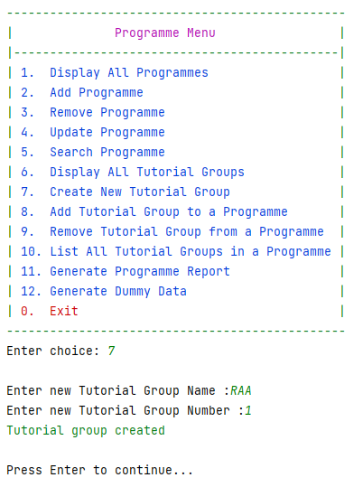 |
| Add tutorial group to a programme |  |
| List all tutorial group under a programme |  |
| Generate programme report |  |
| Remove a tutorial group from a programme |  |
| List the tutorial all tutorial group under a programme |  |

## Part 3 : Tutorial Group Management Subsystem (Dong Wei Jie)

|
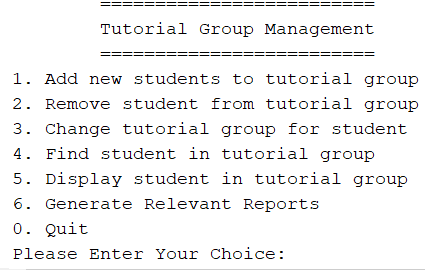

Figure 2.2.1 - Tutorial Group Management Menu
|
| :-: |

### Add

|
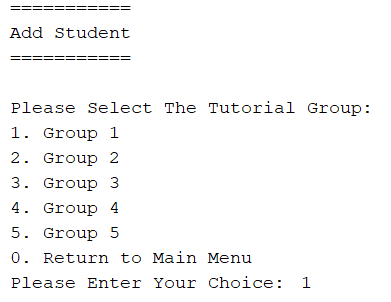

Figure 2.2.2 - Add Student to Tutorial Group

To let the user select any group to add the student in the tutorial group.
|
| :-: |

|

Figure 2.2.2.1 - Add Student to Tutorial Group

Show the name list and let the user to add the student details
|
| :- |

|

Figure 2.2.2.2 - Add Student to Tutorial Group

Show it added “successfully” in group that selected

Figure 2.2.2.3 - Add Student to Tutorial Group

Added Successfully (Megan Loo)
|
| :-: |

|
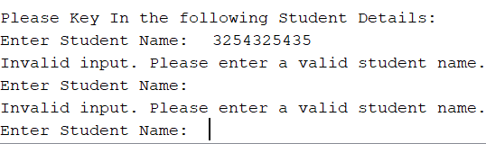

Figure 2.2.2.4 - Add Student to Tutorial Group

If the user input is wrong, then it will show invalid message.
|
| :-: |

### Remove

|

Figure 2.2.3 - Remove Student from Tutorial Group

To let the user select any group to remove the student from the tutorial group.
|
| :-: |

|

Figure 2.2.3.1 - Remove Student from Tutorial Group

It will remove the student by using the student id.
|
| :- |

|

Figure 2.2.3.2 - Remove Student from Tutorial Group

Removed “2309427”.
|
| :- |

### Change

|
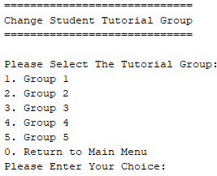

Figure 2.2.4 - Change Student to other Tutorial Group

Let the user change the student to another tutorial group.
|
| :-: |

|

Figure 2.2.4.1 - Change Student to other Tutorial Group

Let the user type in the student id to find the student, if got this student, then it will ask if the user wants to do the changes or not.
|
| :- |

|
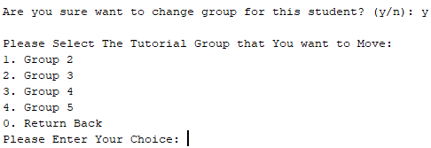

Figure 2.2.4.2 - Change Student to other Tutorial Group

If the user types “y”, then it will ask the user which one that the user wants to change?

If “no”, then it will return back to the change menu. 
|
| :-: |

|

Figure 2.2.4.3 - Change Student to other Tutorial Group

Changed the “Megan Loo” from group 1 to group 2.
|
| :- |

### Find

|
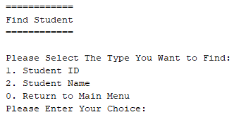

Figure 2.2.5 - Find Student in all group

Let the user find the student by using student id or student name.
|
| :-: |

|
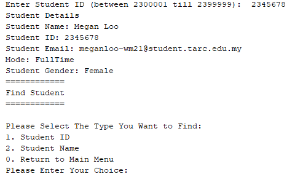

Figure 2.2.5.1 - Find Student in all group

Let the user find the student by using student id, if wrong input or unavailable id, then will show the error validation.
|
| :-: |

|
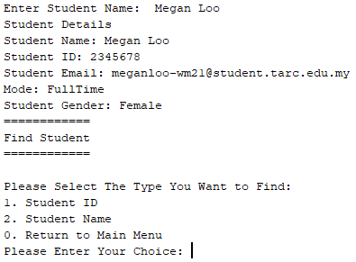

Figure 2.2.5.2 - Find Student in all group

Let the user find the student by using student name, if wrong input or unavailable name, then will show the error validation.
|
| :-: |

### Display

|
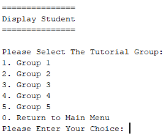

Figure 2.2.6 - Display Student Details in selected group

Display all the student details in a selected group.

|
| :-: |

|

Figure 2.2.6.1 - Display Student Details in selected group

Display all the student details via list in a selected group.
|
| :- |

## Report

|
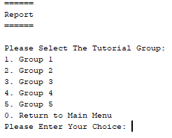

Figure 2.2.7 - Generate Total Student in selected group

Display the total student in a selected group.
|
| :-: |

|
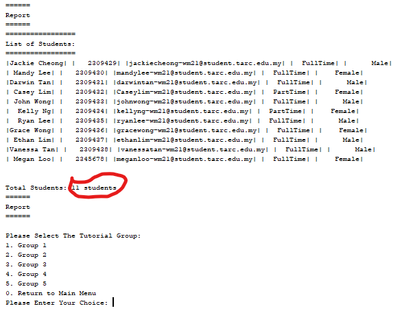

Figure 2.2.7.1 - Generate Total Student in selected group

Display the total student via list in a selected group.
|
| :- |

## Part 4 : Tutor Group Management Subsystem (Desmond Tan Zhe Xuan)

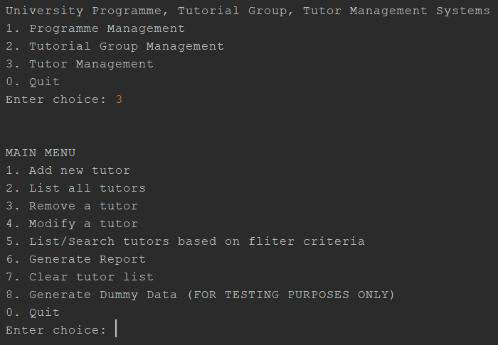

Figure 1: Main Menu -> Tutor Management System

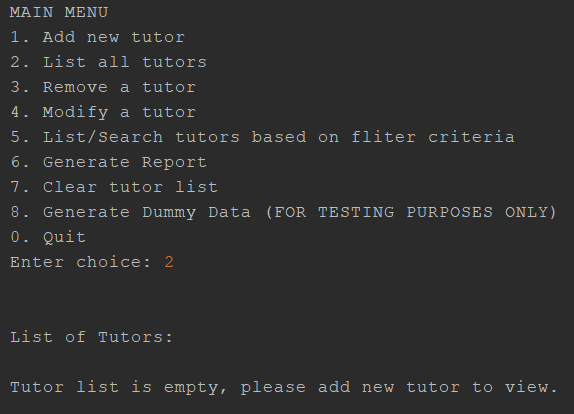

Figure 2: List all tutors when the list is empty.

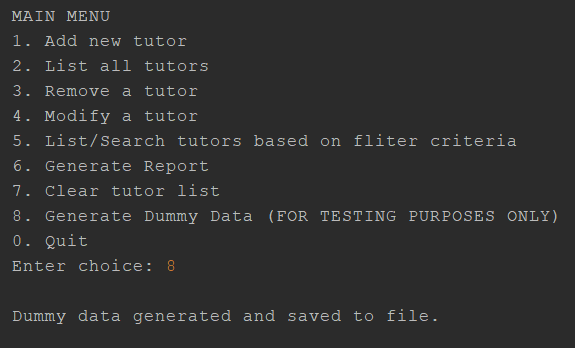

Figure 3: Generate dummy data and save the data into the file.

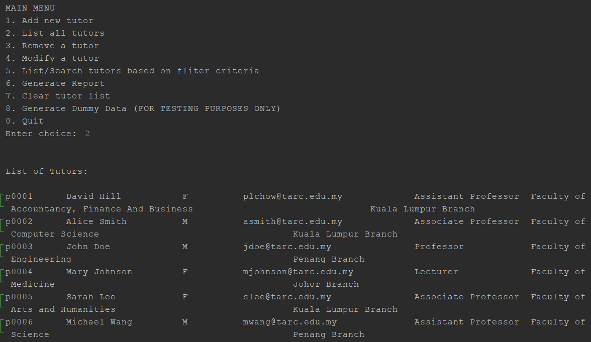
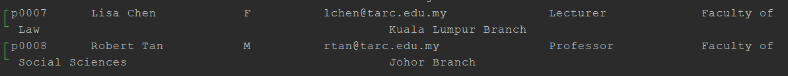

Figure 4: Listing all tutors when the list contained tutor entries.

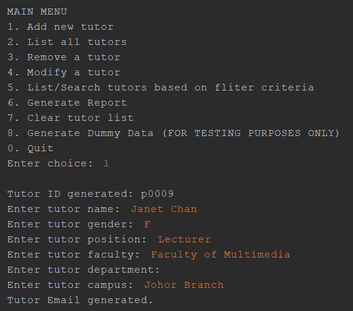

Figure 5: Manually adding a tutor entry. Tutor ID is generated automatically based on the number of entries in the file. Tutor emails are generated based on the tutor's name entry.

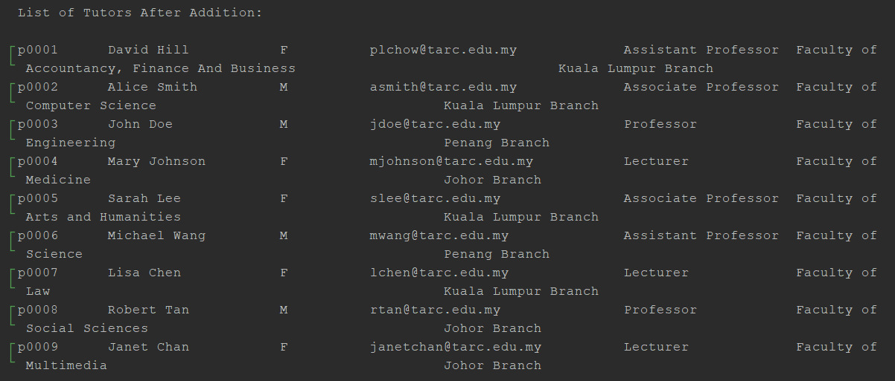

Figure 5.1: The list is displayed again after an entry has been inserted into the file.

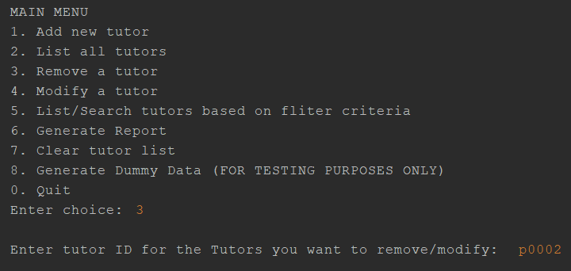

Figure 6: Function to delete a tutor entry, users are required to type in the tutor ID they want to delete.

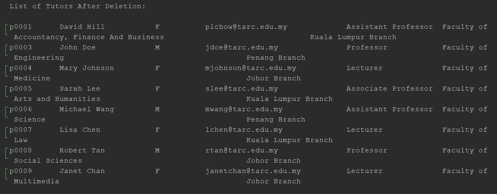

Figure 6.1: The list is displayed again after an entry has been deleted.

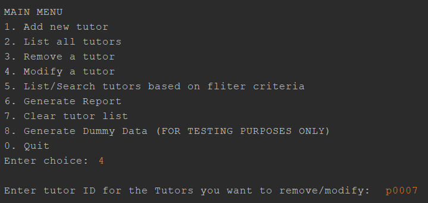

Figure 7: Function to modify a tutor entry, users are required to type in the tutor ID they want to modify.

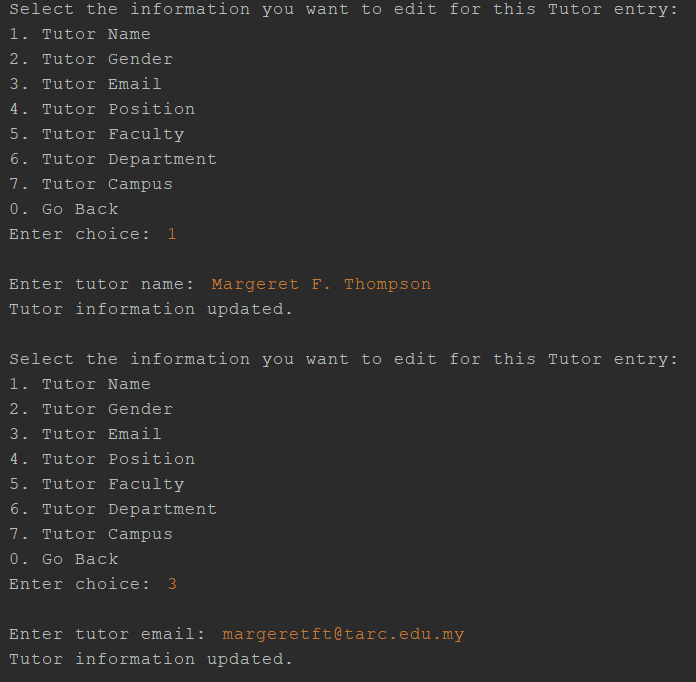

Figure 7.1: Users are required to pick the information the user wants to modify in said tutor entry specified in [Figure 7]. In this screenshot, an email has been modified in this tutor entry.

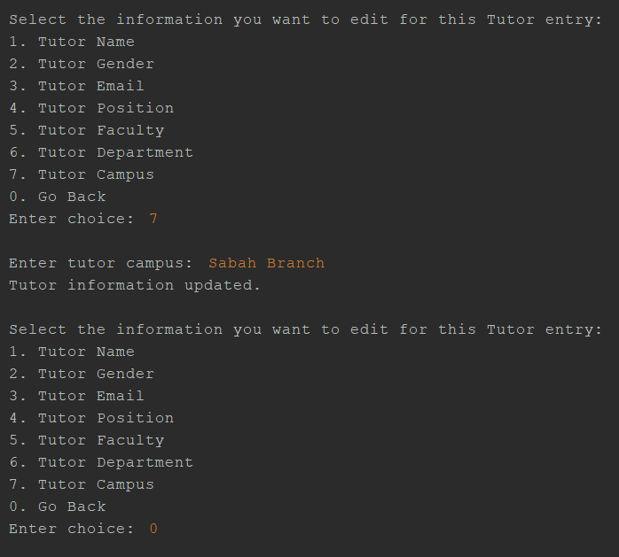

Figure 7.2: The campus information has been modified in this tutor entry. To exit the modify function, you need to input 0 to exit.

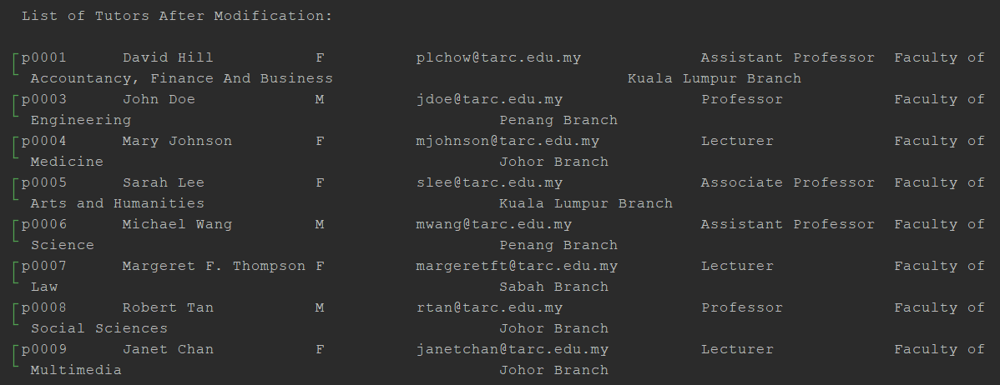

Figure 7.3: The list is displayed again after an entry has been modified.

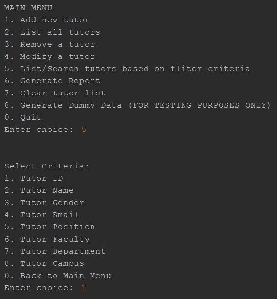

Figure 8: The function lists tutors based on specific criteria. In this screenshot, ID is selected as the criteria to filter by. (The search string you typed in must 100% match the information that is also contained in the entry.)

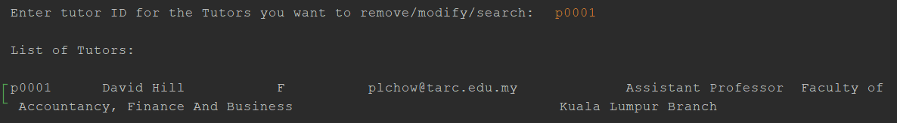

Figure 8.1: Search results of tutors are displayed based on that specific tutor ID.

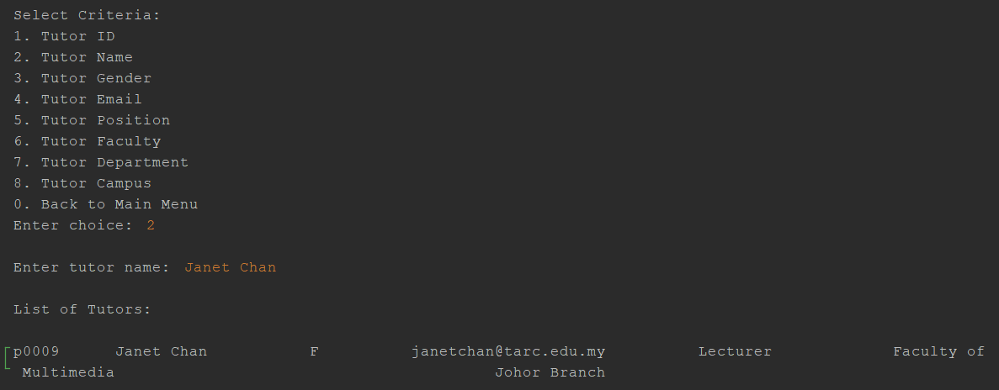

Figure 9: Tutor name has been selected as the criteria to filter by. Search results of tutors are displayed based on that specific tutor name.

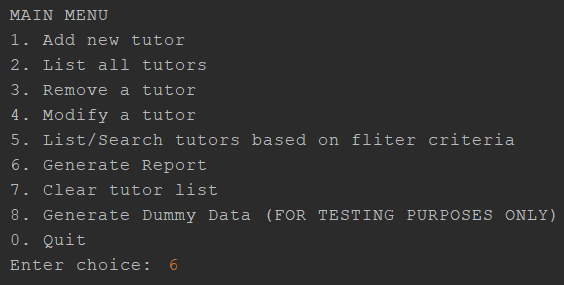
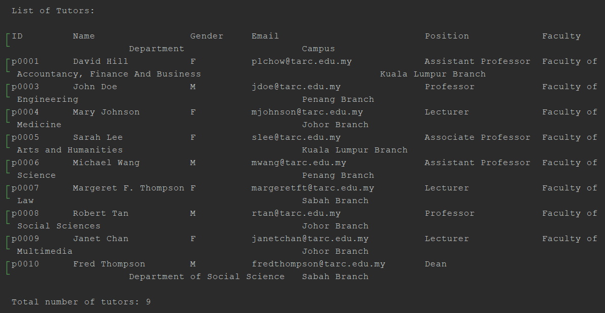

Figure 10: The function to generate tutor list report.

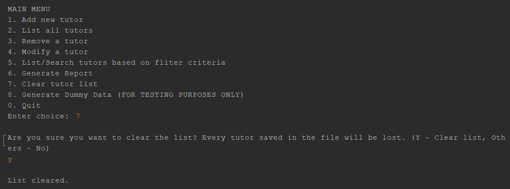
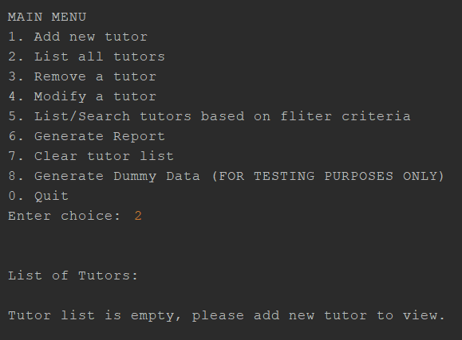

Figure 11: The function to completely clear the entire entry list in the file.

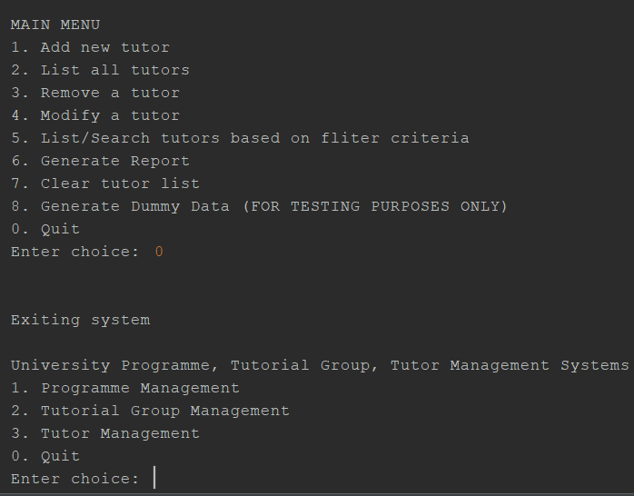

Figure 12: Exiting the tutor management system.
