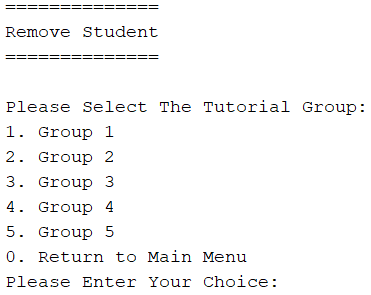

## Tutorial Group Management Subsystem (Dong Wei Jie)

| 

Figure 2.2.1 - Tutorial Group Management Menu
 |
| :------------------------------------------------------------------------------------: |

### Add

| 

Figure 2.2.2 - Add Student to Tutorial Group

To let the user select any group to add the student in the tutorial group.
 |
| :--------------------------------------------------------------------------------------------------------------------------------------------------------------------: |

| 

Figure 2.2.2.1 - Add Student to Tutorial Group

Show the name list and let the user to add the student details
 |
| :----------------------------------------------------------------------------------------------------------------------------------------------------------- |

| 

Figure 2.2.2.2 - Add Student to Tutorial Group

Show it added “successfully” in group that selected

Figure 2.2.2.3 - Add Student to Tutorial Group

Added Successfully (Megan Loo)
 |
| :---------------------------------------------------------------------------------------------------------------------------------------------------------------------------------------------------------------------------------------------------------------------------: |

| 

Figure 2.2.2.4 - Add Student to Tutorial Group

If the user input is wrong, then it will show invalid message.
 |
| :----------------------------------------------------------------------------------------------------------------------------------------------------------: |

### Remove

| 

Figure 2.2.3 - Remove Student from Tutorial Group

To let the user select any group to remove the student from the tutorial group.
 |
| :------------------------------------------------------------------------------------------------------------------------------------------------------------------------------: |

| 

Figure 2.2.3.1 - Remove Student from Tutorial Group

It will remove the student by using the student id.
 |
| :----------------------------------------------------------------------------------------------------------------------------------------------------- |

| 

Figure 2.2.3.2 - Remove Student from Tutorial Group

Removed “2309427”.
 |
| :-------------------------------------------------------------------------------------------------------------------- |

### Change

| 

Figure 2.2.4 - Change Student to other Tutorial Group

Let the user change the student to another tutorial group.
 |
| :-------------------------------------------------------------------------------------------------------------------------------------------------------------: |

| 

Figure 2.2.4.1 - Change Student to other Tutorial Group

Let the user type in the student id to find the student, if got this student, then it will ask if the user wants to do the changes or not.
 |
| :------------------------------------------------------------------------------------------------------------------------------------------------------------------------------------------------------------------------------------------------ |

| 

Figure 2.2.4.2 - Change Student to other Tutorial Group

If the user types “y”, then it will ask the user which one that the user wants to change?

If “no”, then it will return back to the change menu. 
 |
| :-----------------------------------------------------------------------------------------------------------------------------------------------------------------------------------------------------------------------------------------------------------: |

| 

Figure 2.2.4.3 - Change Student to other Tutorial Group

Changed the “Megan Loo” from group 1 to group 2.
 |
| :------------------------------------------------------------------------------------------------------------------------------------------------------ |

### Find

| 

Figure 2.2.5 - Find Student in all group

Let the user find the student by using student id or student name.
 |
| :--------------------------------------------------------------------------------------------------------------------------------------------------------: |

| 

Figure 2.2.5.1 - Find Student in all group

Let the user find the student by using student id, if wrong input or unavailable id, then will show the error validation.
 |
| :-----------------------------------------------------------------------------------------------------------------------------------------------------------------------------------------------------------------: |

| 

Figure 2.2.5.2 - Find Student in all group

Let the user find the student by using student name, if wrong input or unavailable name, then will show the error validation.
 |
| :---------------------------------------------------------------------------------------------------------------------------------------------------------------------------------------------------------------------: |

### Display

| 

Figure 2.2.6 - Display Student Details in selected group

Display all the student details in a selected group.

 |
| :-----------------------------------------------------------------------------------------------------------------------------------------------------------------: |

| 

Figure 2.2.6.1 - Display Student Details in selected group

Display all the student details via list in a selected group.
 |
| :---------------------------------------------------------------------------------------------------------------------------------------------------------------------- |

## Report

| 

Figure 2.2.7 - Generate Total Student in selected group

Display the total student in a selected group.
 |
| :---------------------------------------------------------------------------------------------------------------------------------------------------: |

| 

Figure 2.2.7.1 - Generate Total Student in selected group

Display the total student via list in a selected group.
 |
| :--------------------------------------------------------------------------------------------------------------------------------------------------------------- |
